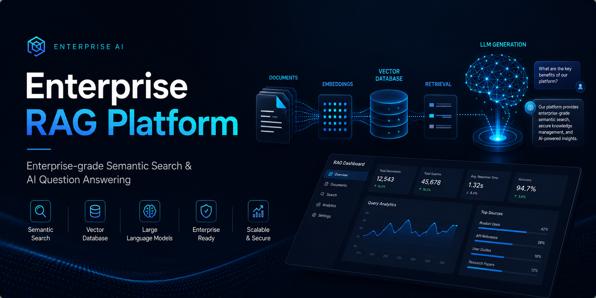
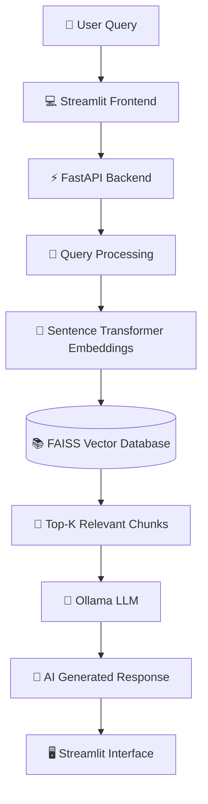

<p align="center">



</p>

<h1 align="center">

🧠 Enterprise RAG Platform

</h1>

<h3 align="center">

Enterprise-grade Retrieval-Augmented Generation (RAG) Platform for Semantic Search & AI-powered Question Answering

</h3>

<p align="center">


</p>

---


# 📖 Overview

Enterprise RAG Platform is a production-inspired Retrieval-Augmented Generation (RAG) system that enables intelligent document search and context-aware question answering using modern Large Language Models (LLMs).

Instead of relying on traditional keyword-based retrieval, the platform leverages semantic embeddings to understand the meaning behind user queries. Relevant document chunks are efficiently retrieved through FAISS vector search and passed to an LLM running locally via Ollama, enabling accurate, context-aware responses.

The project demonstrates a modular AI architecture suitable for enterprise knowledge bases, internal documentation systems, research repositories, and AI-powered assistants.

---

# 🎯 Why This Project?

Organizations manage thousands of pages of documentation, policies, technical manuals, and research papers. Traditional keyword search often fails to retrieve the most relevant information because it cannot understand semantic meaning.

This platform addresses that challenge by combining:

- Semantic document retrieval
- Dense vector search
- Retrieval-Augmented Generation (RAG)
- Large Language Models
- Modular REST APIs

The result is an AI-powered knowledge assistant capable of providing accurate answers grounded in enterprise documents.

---

# ✨ Key Features

- 🔍 Semantic Document Search
- 📄 PDF & Text Document Ingestion
- 🧠 Sentence Transformer Embeddings
- ⚡ FAISS Vector Database
- 🤖 Ollama LLM Integration
- 🚀 FastAPI REST Backend
- 💻 Streamlit User Interface
- 📚 Modular RAG Pipeline
- 🔄 Scalable Architecture
- 🔌 Easy Integration with Custom Knowledge Bases

---

# 📑 Table of Contents

- Overview
- Why This Project?
- Key Features
- AI Pipeline
- Architecture
- Screenshots
- Tech Stack
- Folder Structure
- Installation
- Usage
- API Documentation
- Performance
- Security
- Roadmap
- Contributors
- License

---

# 🧠 AI Pipeline

The application follows a Retrieval-Augmented Generation workflow:

1. User submits a query.
2. Documents are converted into semantic embeddings.
3. FAISS retrieves the most relevant document chunks.
4. Retrieved context is combined with the user query.
5. Ollama-powered LLM generates a context-aware response.
6. The response is displayed through the Streamlit interface.
---

# 🏗️ System Architecture



---

# ⚙️ Technology Stack

| Category | Technologies |
|------------|--------------|
| **Language** | Python |
| **Frontend** | Streamlit |
| **Backend** | FastAPI |
| **Vector Database** | FAISS |
| **Embeddings** | Sentence Transformers |
| **LLM** | Ollama (Llama 3) |
| **API** | REST |
| **Deployment** | Local / Docker (Planned) |

---

# 📂 Project Structure

```text
Enterprise-RAG-Platform/

│
├── api/
│   └── main.py
│
├── frontend/
│   └── app.py
│
├── src/
│   ├── chunker.py
│   ├── config.py
│   ├── ingest.py
│   ├── llm.py
│   ├── pdf_ingest.py
│   ├── rag.py
│   └── search.py
│
├── vectorstore/
│   ├── faiss.index
│   └── docs.pkl
│
├── data/
│
├── assets/
│   ├── architecture.png
│   ├── dashboard.png
│   ├── search.png
│   ├── result.png
│   └── demo.gif
│
├── requirements.txt
│
└── README.md
```

---

# 📸 Application Preview

> Replace these placeholders with actual screenshots after running the project.

## Dashboard

<p align="center">


</p>

---

## Semantic Search

<p align="center">


</p>

---

## AI Generated Answer

<p align="center">


</p>

---

# 🎥 Demo

<p align="center">


</p>

---

# 🚀 Key Capabilities

## 📄 Intelligent Document Processing

- Automatic document ingestion
- Smart text chunking
- Metadata preservation
- Scalable indexing pipeline

---

## 🔍 Semantic Retrieval

- Dense vector search
- Context-aware retrieval
- High-speed similarity matching
- Top-K relevant chunk extraction

---

## 🤖 AI Question Answering

- Retrieval-Augmented Generation
- Context-aware LLM responses
- Reduced hallucinations
- Enterprise knowledge assistance

---

## ⚡ Backend Services

- RESTful FastAPI APIs
- Modular architecture
- Easy integration
- High maintainability

---

# 📈 RAG Workflow

```text
User Query
      │
      ▼
Embedding Generation
      │
      ▼
FAISS Similarity Search
      │
      ▼
Retrieve Relevant Chunks
      │
      ▼
Prompt Construction
      │
      ▼
Ollama LLM
      │
      ▼
Generated Answer
```

---

# 💡 Enterprise Use Cases

✔ Internal Knowledge Assistant

✔ HR Policy Search

✔ Legal Document Retrieval

✔ Technical Documentation Search

✔ Customer Support Assistant

✔ Research Paper Exploration

✔ Enterprise Chatbot

✔ Corporate Knowledge Base
---

# 🚀 Installation

## Prerequisites

Before running the project, ensure the following are installed:

- Python 3.11+
- Git
- Ollama
- pip

---

## Clone the Repository

```bash
git clone https://github.com/Jeyceo21/Enterprise-RAG-Platform.git
cd Enterprise-RAG-Platform
```

---

## Install Dependencies

```bash
pip install -r requirements.txt
```

---

## Install Ollama

Download and install Ollama:

https://ollama.com

Pull the Llama model:

```bash
ollama pull llama3
```

---

## Build the Vector Database

```bash
python src/ingest.py
```

---

## Start the FastAPI Backend

```bash
uvicorn api.main:app --reload
```

Backend URL

```
http://localhost:8000
```

---

## Launch the Streamlit Frontend

```bash
streamlit run frontend/app.py
```

Application URL

```
http://localhost:8501
```

---

# 💻 Usage

1. Upload your documents.
2. Generate embeddings.
3. Index documents into FAISS.
4. Start the FastAPI server.
5. Open the Streamlit interface.
6. Ask natural language questions.
7. Receive AI-generated answers grounded in your documents.

---

# 🌐 REST API

## Generate Response

### Endpoint

```
POST /generate
```

### Request

```json
{
  "query": "Explain Retrieval Augmented Generation"
}
```

### Response

```json
{
  "answer": "Retrieval-Augmented Generation (RAG) combines semantic retrieval with Large Language Models to generate context-aware responses."
}
```

---

# ⚡ Performance

The platform is designed with scalability in mind.

### Current Capabilities

- Fast semantic search using FAISS
- Low-latency vector retrieval
- Local LLM inference with Ollama
- Modular architecture for easy expansion

### Suitable For

- Enterprise documentation
- Research repositories
- Internal knowledge bases
- AI assistants
- Technical documentation search

---

# 🔒 Security Considerations

Current implementation includes:

- Local document processing
- Local LLM execution
- No third-party API dependency
- Modular backend architecture

Planned enhancements:

- Authentication
- Role-Based Access Control (RBAC)
- HTTPS deployment
- Secure API keys
- Audit logging

---

# 🛣️ Roadmap

## Phase 1

- [x] Semantic Search
- [x] FastAPI Backend
- [x] Streamlit Frontend
- [x] FAISS Integration
- [x] Ollama Integration

---

## Phase 2

- [ ] Multi-document collections
- [ ] Hybrid Search (Keyword + Semantic)
- [ ] Metadata Filtering
- [ ] Conversation Memory

---

## Phase 3

- [ ] Docker Support
- [ ] Kubernetes Deployment
- [ ] CI/CD Pipeline
- [ ] Cloud Deployment (AWS / Azure / GCP)
- [ ] User Authentication

---

# 🤝 Contributing

Contributions are welcome.

To contribute:

1. Fork the repository.
2. Create a new feature branch.
3. Commit your changes.
4. Push the branch.
5. Open a Pull Request.

---

# 👨‍💻 Author

### Jeyanthan Petchimuthu

AI Engineer | Machine Learning Engineer | Full Stack Developer

- GitHub: https://github.com/Jeyceo21
- LinkedIn: https://www.linkedin.com/in/jeyanthan-petchimuthu-777ba6329/

---

# 📜 License

This project is licensed under the MIT License.

See the LICENSE file for more details.

---

# ⭐ Support

If you found this project useful,

please consider giving it a ⭐ on GitHub.

It helps others discover the project and motivates future development.

---

<p align="center">

Built with ❤️ using Python, FastAPI, FAISS, Ollama, Streamlit and Large Language Models.

</p>

<p align="center">


</p>
