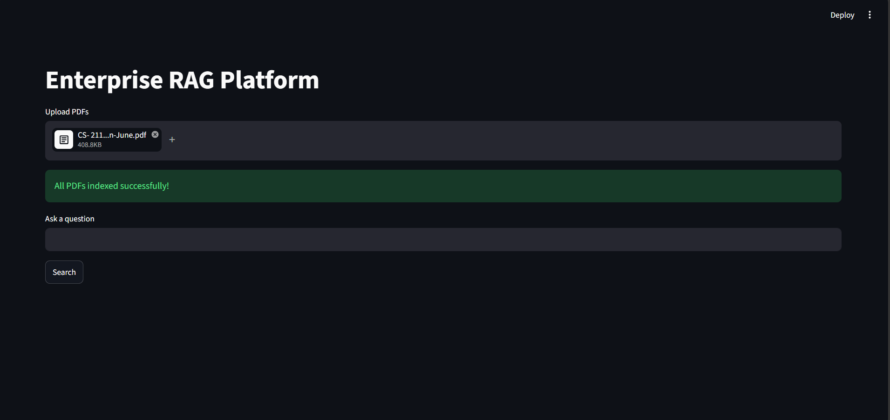
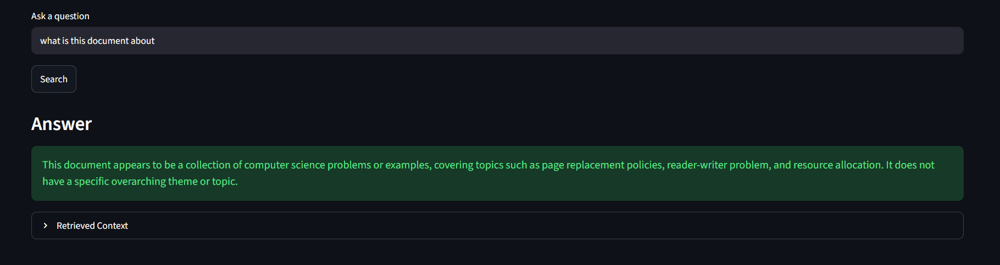
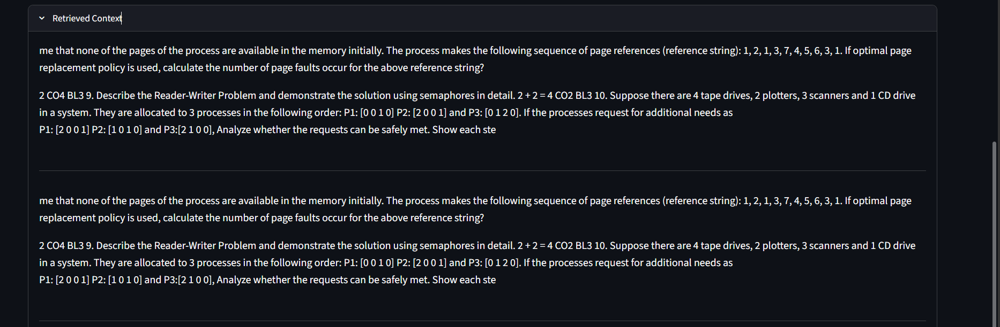

# Enterprise RAG Platform

An end-to-end Retrieval-Augmented Generation (RAG) platform built using FastAPI, Streamlit, FAISS, Sentence Transformers, and Ollama.

## Features

- Upload PDF documents
- Automatic text extraction and chunking
- Semantic search using Sentence Transformers
- FAISS vector database
- Local LLM inference using Ollama + Llama 3
- FastAPI backend
- Streamlit frontend
- Context-aware question answering

---

## Tech Stack

- Python
- FastAPI
- Streamlit
- FAISS
- Sentence Transformers
- Ollama
- Llama 3

---

## Project Architecture

PDF Upload
↓
Text Extraction
↓
Chunking
↓
Embedding Generation
↓
FAISS Vector Store
↓
Semantic Search
↓
Context Retrieval
↓
Llama 3 Response Generation

---

## Installation

### Clone Repository

```bash
git clone https://github.com/Jeyceo21/Enterprise-RAG-Platform.git
cd Enterprise-RAG-Platform
```

### Create Virtual Environment

```bash
python -m venv venv
```

### Activate Environment

```bash
venv\Scripts\activate
```

### Install Dependencies

```bash
pip install -r requirements.txt
```

### Start Backend

```bash
python -m uvicorn api.main:app --reload
```

### Start Frontend

```bash
streamlit run frontend/app.py
```

---

## Example Questions

- What is this document about?
- Summarize the uploaded PDF.
- What are the key topics discussed?
- Explain the concepts mentioned in the document.

---

## Future Improvements

- Hybrid Search (BM25 + FAISS)
- Citation-based answers
- Chat memory
- Multi-document comparison
- Cloud deployment
- Authentication

---

## Screenshots

### PDF Upload



### Question Answering



### Retrieved Context




## Author

Jeyanthan Petchimuthu
